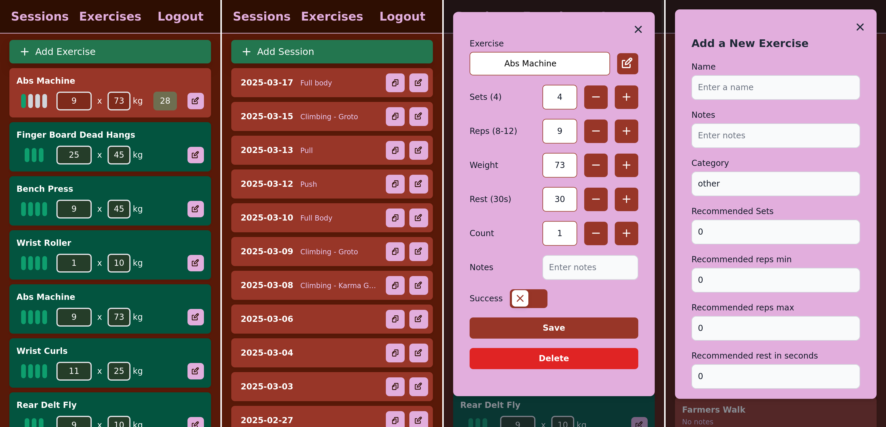

# Pleustradenn 🏋️‍♂️

> **Pleustradenn** is a personal-workout web application written in TypeScript with SvelteKit + Prisma.
> The goal is to make recording sets, monitoring progress and planning the next session friction-less on desktop *and* mobile.

&#x20;


## ✨ Key features

* **Session & exercise tracker** – add sets, reps, load, rest and notes in seconds.
* **Smart defaults** – the app remembers the previous load/rep scheme for every exercise.
* **Multi-language exercise names** – English, French and Polish supported out-of-the-box.
* **Instant search & filters** for a growing exercise catalogue.
* **Dark-mode-friendly UI** built with TailwindCSS.
* **SQLite by default, but any Prisma-supported DB** can be plugged in.
* **100 % open-source** (GPL-3.0) – self-host or extend as you like.


## 🚀 Getting started (local dev)

### 1. Prerequisites

* Node >= 20
* npm (comes with Node) or pnpm
* SQLite (only if you want to inspect the DB file directly)

### 2. Clone & install

```bash
git clone https://github.com/MathieuMoalic/pleustradenn.git
cd pleustradenn
npm install        # or pnpm install
```

### 3. Configure environment

Create a `.env` file in the project root and set **at least** `DATABASE_URL`:

```bash
# .env
DATABASE_URL="file:./data.db"
```

> Any valid Prisma connection string works – PostgreSQL, MySQL, etc.

### 4. Create / sync the database

```bash
npx prisma db push        # creates tables from the schema
npx prisma generate       # generates the client
```

### 5. Run the dev server

```bash
npm run dev               # http://localhost:5173
```

The API endpoints live under `/api/*` and the UI hot-reloads on save.

---

## 🏗️ Production build

```bash
npm run build     # optimized, adapter-node output
node build        # serve on port 3000 by default
```

---

## 🙋 Contributing

Bug reports, feature requests and PRs are very welcome!
Please open an issue first if you plan a larger change so we can discuss the approach.

---

## 📜 Licence

Pleustradenn is released under the **GNU GPL-3.0** licence.
See [`LICENSE`](LICENSE) for the full text.
